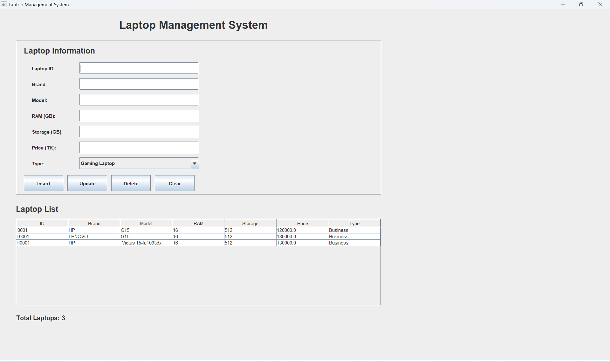

# 💻 Laptop Management System

A simple Java Swing desktop application for managing laptop information.

## 📌 About the Project

The Laptop Management System is a beginner-friendly Java desktop application developed using Java Swing.

It allows users to manage laptop information through a graphical user interface.

## ✨ Features

- ➕ Add laptop information
- ✏️ Update laptop information
- 🗑️ Delete laptop information
- 🧹 Clear input fields
- 📋 Display laptop information in a table
- 💾 Store laptop data using a text file
- 🎮 Support for Gaming Laptop
- 💼 Support for Business Laptop

## 🛠️ Technologies Used

- Java
- Java Swing
- OOP (Object-Oriented Programming)
- File Handling
- Git
- GitHub

## 📁 Project Structure

```text
LaptopManagementApplication/
│
├── gui/
│   └── LaptopManagementGUI.java
│
├── model/
│   ├── Laptop.java
│   ├── GamingLaptop.java
│   └── BusinessLaptop.java
│
├── service/
│   └── LaptopManager.java
│
├── Start.java
├── laptop_data.txt
└── .gitignore

▶️ How to Run
1.Clone the repository.
2.Open the project in VS Code or any Java IDE.
3.Compile the Java files.
4.Run Start.java.

## 📸 Screenshots



🎯 Purpose

This project was developed as a Java programming project to practice:

* Object-Oriented Programming
* Inheritance
* Java Swing GUI
* File Handling
* Basic CRUD operations

👨‍💻 Author
Mohammod Mustakim

